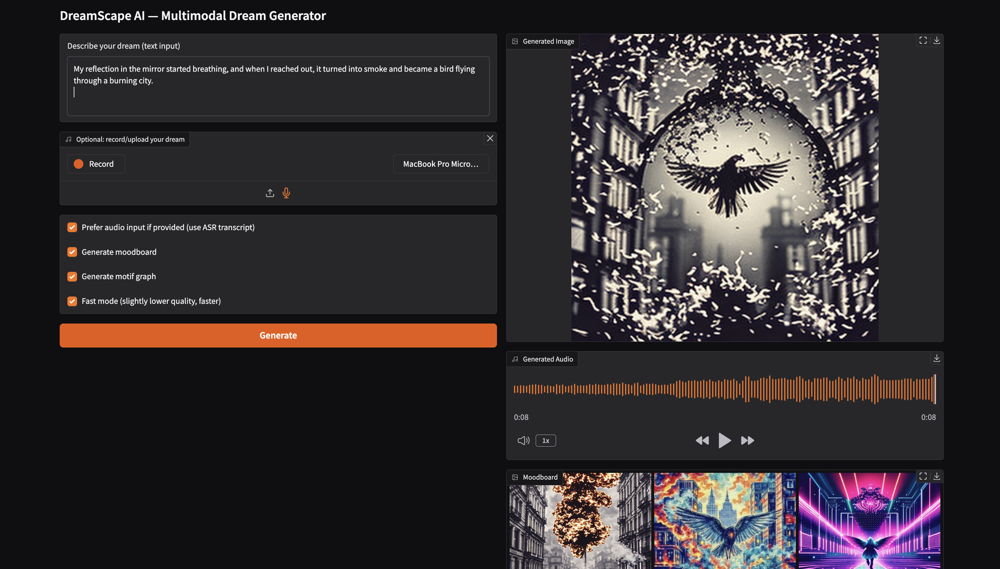
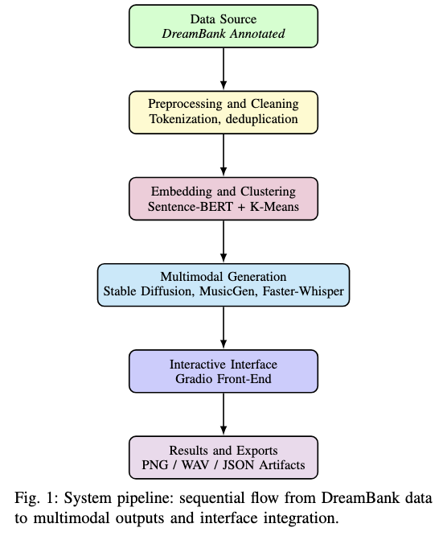

# 🌌 DreamScape AI — From Blueprint to Prototype  
### Deliverable 2 · Implementation and Early Evaluation  
**Author:** Deepika Sarala Pratapa  |  **Course:** EEE 6778 – Applied Machine Learning II (University of Florida)

---

## 🪄 Project Overview
**DreamScape AI** is a multimodal AI system that transforms written or spoken dream descriptions into **visual moodboards, ambient soundscapes, and symbolic motif graphs**.  
It bridges creativity, psychology, and machine learning — allowing subconscious patterns to be visualized through AI.

Deliverable 2 presents the **first fully functional prototype**, integrating:
> DreamBank dataset → NLP embedding → Diffusion & Audio Generation → Gradio Interface (inside Jupyter)

---

## 🎯 Objectives (Deliverable 2)
- Build an **end-to-end dream generation pipeline** from text ingestion to multimodal outputs.  
- Use **Sentence-BERT embeddings** and **K-Means clustering** to uncover latent dream motifs.  
- Generate images and music using **Stable Diffusion Turbo** and **MusicGen**.  
- Implement **speech transcription** (Faster-Whisper) and **motif visualization** (NER + NetworkX).  
- Embed a **Gradio-based user interface** directly within the notebook.  
- Document early evaluation metrics and visuals.

---

## 🧱 Repository Structure
```
dreamscape-ai/
│
├── data/
│   ├── raw/
│   └── processed/
│        └── dreambank_clean.json       # Cleaned dream dataset (~1000 entries)
│
├── notebooks/
│   ├── setup.ipynb                     # Dataset load + schema verification
│   ├── exploratory_data_analysis.ipynb # Dream length + emotion analysis
│   ├── nlp_motif_extraction.ipynb      # Sentence-BERT embeddings + K-Means
│   └── multimodal_generation.ipynb     # Diffusion + MusicGen + Gradio UI
│
├── results/
│   ├── dream_length_distribution.png
│   ├── eda_emotion_distribution.png
│   ├── nlp_clusters.png
│   ├── dream_20251109_142615.png
│   ├── dream_20251109_142714_moodboard.png
│   └── dream_20251109_142714_motifs.png
│
├── docs/
│   ├── architecture.png
│   ├── ui_screenshot.png
│   └── deliverable2_ieee.pdf           # IEEE-format report for submission
│
├── requirements.txt
├── environment.yml
├── README.md
└── LICENSE
```
---

## 🧠 Dataset Summary
**Dataset:** [DreamBank Annotated – Gustave Cortal (2023)](https://huggingface.co/datasets/gustavecortal/DreamBank-annotated)  
**Type:** 27,952 dream narratives with HVdC-coded emotions and characters  
**Subset Used:** 1,000 entries for experimentation  

### Preprocessing (in `setup.ipynb`)
- Dropped null or <50-character entries  
- Normalized text fields (`report → text`)  
- Parsed HVdC emotion and character codes  
- Computed dream length, word counts, and descriptive statistics  
- Saved cleaned dataset as `data/processed/dreambank_clean.json`

---

## ⚙️ Environment Setup
### 1️⃣ Create Environment
```bash
conda create -n dreamscape python=3.11 -y
conda activate dreamscape
pip install -r requirements.txt
```

2️⃣ (Optional) Add Jupyter Kernel
```bash
pip install jupyterlab ipykernel
python -m ipykernel install --user --name dreamscape --display-name "DreamScape AI"
```

## ▶️ Running the Pipeline

### **Step 1 · Data Setup**
**Notebook:** `notebooks/setup.ipynb`  

✅ Loads dataset from Hugging Face  
✅ Cleans and validates schema  
✅ Saves cleaned JSON file → `data/processed/dreambank_clean.json`  

---

### **Step 2 · Exploratory Data Analysis**
**Notebook:** `notebooks/exploratory_data_analysis.ipynb`  

**Outputs:**
- `results/dream_length_distribution.png` — distribution of dream lengths  
- `results/eda_emotion_distribution.png` — bar plot of HVdC emotion codes  

**Observations:**
- Dreams average **171 words**, with most ranging between **50–250 words**.  
- Emotion tags (e.g., *AP, HA, AN, SD*) show **balanced polarity**, making the dataset suitable for affective modeling.

---

### **Step 3 · Motif and Embedding Extraction**
**Notebook:** `notebooks/nlp_motif_extraction.ipynb`  

✅ Generates **Sentence-BERT embeddings (384-D)**  
✅ Performs **K-Means clustering (k = 8)**  
✅ Extracts **top TF-IDF keywords** per motif cluster  
✅ Saves visualization → `results/nlp_clusters.png`  

**Observations:**
- Clusters correspond to interpretable dream motifs such as **movement**, **family**, **water**, and **anxiety**.
- 
### **Step 4 · Multimodal Generation**

**Notebook:** `notebooks/multimodal_generation.ipynb`  

This notebook unifies **text-to-image**, **text-to-audio**, and **entity graph** modules into a single multimodal framework.

**Models Used:**

| **Component** | **Model** | **Description** |
|:---------------|:----------|:----------------|
| 🖼️ **Image** | `stabilityai/sd-turbo` | Fast diffusion model for dream-like visuals |
| 🎵 **Audio** | `facebook/musicgen-small` | Text-to-music model generating ambient soundscapes |
| 🎙️ **ASR** | `faster-whisper (small/int8)` | Speech-to-text transcription model |
| 🕸️ **Motif Graph** | `dslim/bert-base-NER` | Entity extraction for co-occurrence graph visualization |

**Outputs:**
- `results/dream_20251109_142615.png` — generated surreal image  
- `results/dream_20251109_142714_moodboard.png` — artistic collage (6 visual styles)  
- `results/dream_20251109_142714_motifs.png` — motif graph showing co-occurring symbols  

---

### **Step 5 · Interactive Gradio Interface (Inside Notebook)**

The final cell in `multimodal_generation.ipynb` launches an **interactive Gradio interface** directly within the notebook for real-time exploration.

**Features:**
- Accepts **text or audio** input  
- Toggles for *Generate Moodboard*, *Generate Motif Graph*, and *Fast Mode*  
- Displays generated **image**, **audio**, **moodboard**, **motif graph**, **toxicity score**, and **transcribed text**  
- Runs entirely **locally** on CPU or MPS — no cloud API required  



---

## 📊 **Early Evaluation**

| **Component** | **Avg CPU Runtime (s)** | **Notes** |
|:---------------|:----------------------:|:-----------|
| Stable Diffusion Turbo (512², 4 steps) | 6.3 ± 0.7 | Fast and consistent rendering |
| Moodboard (6 tiles) | 18.6 ± 1.8 | Multi-style batch generation |
| MusicGen Audio (8 s) | 7.9 ± 0.8 | Smooth, ambient synthesis |
| Faster-Whisper ASR | 3.2 ± 0.3 | Accurate and low-latency transcription |
| Motif Graph (NER) | 1.1 ± 0.2 | Lightweight entity co-occurrence mapping |

**Example Prompt:**
> “My reflection in the mirror started breathing, then turned into a bird flying through a burning city.”

**Generated Results:**
- 🖼️ **Image:** `dream_20251109_142615.png` – surreal cinematic composition  
- 🎵 **Audio:** reflective, tense ambient pads  
- 🕸️ **Motif Graph:** `dream_20251109_142714_motifs.png` – connections: *mirror → bird → city → fire*  

➡️ These demonstrate strong **cross-modal semantic coherence** between text, image, and sound outputs.

---

## 🧩 **System Architecture**



| **Stage** | **Description** | **Libraries / Models** |
|:-----------|:----------------|:------------------------|
| **Data Processing** | Cleaning, preprocessing, and exploratory analysis | pandas, seaborn |
| **Embedding & Clustering** | Sentence-BERT embeddings + K-Means clustering | sentence-transformers, scikit-learn |
| **Image Generation** | Text → Image diffusion synthesis | diffusers (`sd-turbo`) |
| **Audio Generation** | Text → Music generation | transformers (`facebook/musicgen-small`) |
| **Speech Recognition** | Audio → Text transcription | faster-whisper |
| **Motif Graphing** | Named entity extraction + co-occurrence visualization | networkx, dslim/bert-base-NER |
| **Interface** | Interactive notebook-based app | Gradio |

---

## ⚖️ **Responsible AI Reflection**

DreamScape AI adheres to transparent, ethical, and sustainable AI practices:

- 🧩 **Dataset Integrity:** DreamBank (CC BY 4.0) is publicly available and anonymized.  
- 🛡️ **Safety:** Detoxify filters toxic inputs; the diffusion model’s safety checker blurs sensitive content.  
- 🔍 **Transparency:** All generated outputs are clearly labeled as AI-created.  
- 🔒 **Privacy:** No personal data or prompts are stored or transmitted externally.  
- ⚙️ **Efficiency:** Optimized for CPU/MPS execution to minimize computational overhead.  

---

## 📚 **References**

- Hall & Van de Castle (1966). *The Content Analysis of Dreams.*  
- Cortal, G. (2023). *DreamBank Annotated* [Dataset]. Hugging Face.  
- Rombach et al. (2022). *High-Resolution Image Synthesis with Latent Diffusion Models.*  
- Copet et al. (2023). *MusicGen: Simple and Controllable Music Generation.*  
- Sanh et al. (2020). *dslim/bert-base-NER.* Hugging Face.  
- Kim (2023). *Faster-Whisper.* GitHub.  
- Unitary AI (2020). *Detoxify: Toxic Comment Classification.*

---

🧾 License

All original code © 2025 Deepika Sarala Pratapa — released under the MIT License.
DreamBank Annotated dataset © Gustave Cortal (2023) — CC BY 4.0.
---

## 👩‍💻 **Author**

**Deepika Sarala Pratapa**  
M.S. in Applied Data Science @ University of Florida  
📧 [dpratapa@ufl.edu](mailto:dpratapa@ufl.edu)  

---

> “DreamScape AI doesn’t just analyze dreams — it brings them to life.” 🌠


