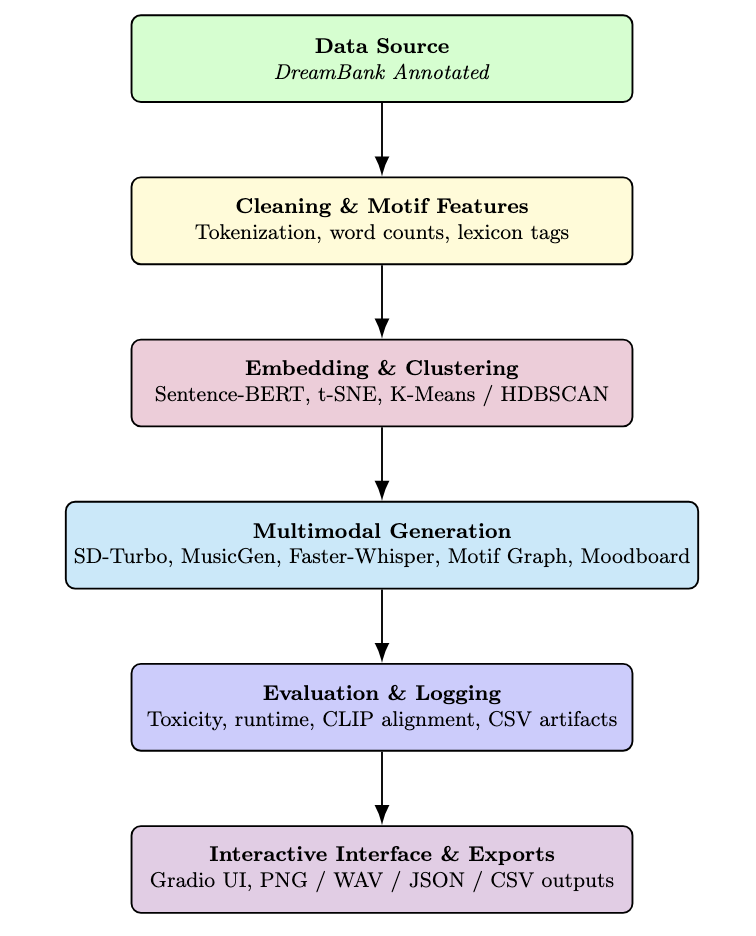
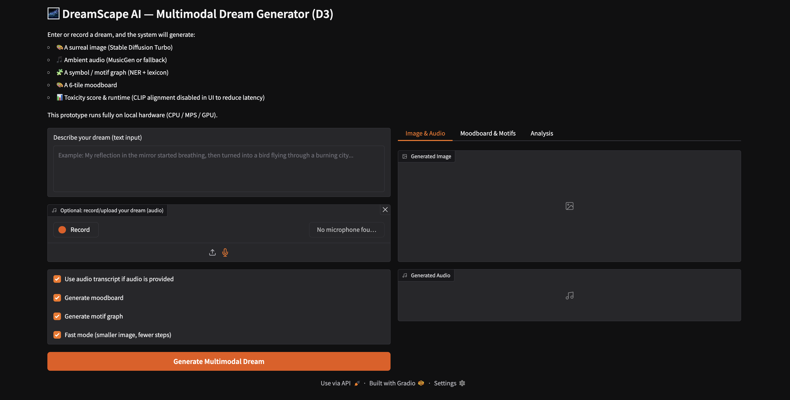
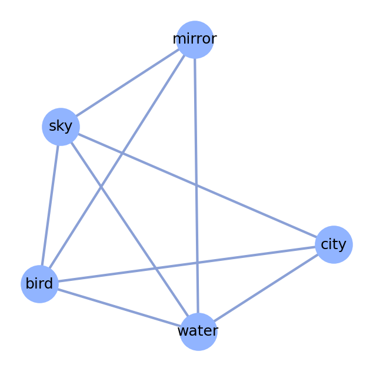

# 🌌 DreamScape AI — Deliverable 3  
### Refinement • Usability • Extended Evaluation  
**Author:** Deepika Sarala Pratapa  
**Course:** EEE 6778 – Applied Machine Learning II  
**University of Florida**

## 🚀 Live Demo

Hugging Face Space: https://huggingface.co/spaces/dpratapa/DreamScapeAI

---

## 🧠 1. Project Overview
DreamScape AI is a multimodal generative system that transforms written or spoken dream descriptions into multiple synchronized outputs:

- 🖼️ Surreal dream image (Stable Diffusion Turbo)  
- 🎵 Ambient soundtrack (MusicGen)  
- 🎨 Six-style moodboard  
- 🕸️ Symbolic motif graph (NER + lexicon filtering)  
- 📊 Runtime, toxicity, and alignment diagnostics  

Deliverable 3 focuses on **refinement**, **speed**, **usability**, and **extended evaluation**.  
The pipeline is now modular, faster, and ready for deployment through a stable Gradio interface.

---

## 📁 2. Repository Structure
```
dreamscape-ai/
│
├── data/
│   ├── raw/                # Original DreamBank or audio/text inputs
│   └── processed/          # Cleaned + precomputed assets
│        ├── dreambank_clean.json      # Final cleaned dataset used across all D1–D3
│        ├── dream_embeddings.npy      # SBERT embeddings for clustering & t-SNE
│        └── cluster_keywords.json     # TF-IDF keywords for each cluster (D3)
│
├── docs/
│   ├── architecture.png              # System architecture (Deliverable 2)
│   ├── ui_d3_overview.png            # Updated UI screenshot (Deliverable 3)
│   └── ui_screenshot.png              # Early UI snapshot
│   └── pipeline.png                   # Updated pipeline diagram for D3 refinements
│
├── notebooks/
│   ├── setup.ipynb                      # Deliverable 1: dataset load, cleaning, schema checks
│   ├── exploratory_data_analysis.ipynb  # Deliverable 2: dream length/emotions EDA
│   ├── nlp_motif_extraction.ipynb       # Deliverable 2: SBERT embeddings + K-Means
│   ├── multimodal_generation.ipynb      # Deliverable 2: first full multimodal pipeline + UI
│   ├── nlp_motif_extraction_d3.ipynb     # Deliverable 3: HDBSCAN, t-SNE, motif refinements
│   ├── multimodal_generation_d3.ipynb   # Deliverable 3: optimized generation, fast mode
│   ├── evaluation_multimodal_d3.ipynb   # Deliverable 3: runtime, CLIPScore, toxicity eval
│   └── evaluation_results/              # Auto-saved evaluation artifacts
│        └── (generated images, audio, moodboards, motifs)
│
├── results/
│   ├── nlp_tsne_d3.png
│   ├── nlp_clusters_kmeans_d3.png
│   ├── nlp_clusters_hdbscan_d3.png
│   ├── nlp_emotion_heatmap_kmeans_d3.png
│   └── eval_runtime_hist.png
│
├── ui/
│   ├── app.py         # Final Gradio interface (standalone, deploy-ready) 
│   └── ui_results/     # Outputs generated via UI testing
│        └── (image/audio/motif/moodboard outputs)
│
├── requirements.txt      # All dependencies for reproducibility
├── README.md
└── LICENSE
```

---

## ⚙️ 3. Environment Setup

### 1️⃣ Create and activate environment
```bash
conda create -n dreamscape python=3.11 -y
conda activate dreamscape
pip install -r requirements.txt
```
### 2️⃣ (Optional) Add Jupyter kernel
```bash
pip install jupyterlab ipykernel
python -m ipykernel install --user --name dreamscape --display-name "DreamScape AI"
```

## 🏗️ 4. Updated Architecture (Deliverable 3)

### 🔧 **Refined Pipeline**


The pipeline now includes:
- modular function blocks  
- centralized saving logic  
- fast-mode diffusion  
- lexicon-guided motif extraction  

---

## 🎨 5. Gradio Interface (Deliverable 3)

### 📺 **Updated UI Layout**


UI now includes:
- Three-tab output layout  
- Default example prompts  
- Safer file paths  
- More stable audio playback  

---
## ▶️ 6. Running the System
### A. Launch the Gradio Interface
Runs the full image–audio–moodboard–motif pipeline.
```bash
cd ui
python app.py
```
Open the browser interface link generated.

### B. Run Evaluation Notebooks
- evaluation_multimodal_d3.ipynb
- nlp_motif_extraction_d3.ipynb
- exploratory_data_analysis.ipynb

All evaluation figures and outputs are saved automatically into:
```
results/
notebooks/evaluation_results/
ui/ui_results/
```

## 🚀 7. Key Improvements Since Deliverable 2

### 💡 System & Codebase
- Refactored into a clean module structure (`src/`, `ui/`, `results/`).
- All multimodal generation moved into `multimodal_generation_d3.py`.
- Gradio interface migrated from notebook → standalone script (`ui/app.py`).
- Faster inference defaults (4–6 diffusion steps).
- Stable timestamped output directories for reproducibility.

### 🧩 Interface Enhancements
- Three-tab layout (Image/Audio • Moodboard/Motifs • Analysis).
- More robust audio handling and safer file paths.
- Includes default example prompts.
- Automatic fallback audio if MusicGen fails.

### 📊 Extended Evaluation
- t-SNE embedding map  
- K-Means and HDBSCAN clustering  
- Emotion heatmap by cluster  
- Runtime distribution histogram  
- CLIPScore and toxicity evaluation  
- Per-dream quantitative table  

## 🌈 8. Example Outputs (Deliverable 3)

Below are representative multimodal outputs generated by DreamScape AI during Deliverable 3  
These examples demonstrate coherence across **image**, **style**, and **symbolic motif extraction**.

Prompt
```
I was standing in front of a tall mirror that didn’t show my reflection.
Instead, the surface rippled like water.
When I reached out to touch it, a bright bird burst out from inside the mirror and flew upward into a burning orange sky.
The city around me felt abandoned, with empty streets and shadows moving on their own.
```

---

### 🖼️ Generated Dream Image  
A surreal visual rendering produced by **Stable Diffusion Turbo** from the dream prompt.


---

### 🎨 Six-Style Moodboard  
A style-diverse moodboard exploring six artistic interpretations of the same dream.


---

### 🕸️ Symbolic Motif Graph  
A graph of entities extracted using **BERT-NER + lexicon filtering**, showing symbolic co-occurrence patterns.



---

## 📈 9. Updated Evaluation Results

Below is the quantitative evaluation from Deliverable 3, including runtime, toxicity, and CLIPScore for each dream in the test set:

| **Dream ID**   | **Words** | **Runtime (s)** | **Toxicity** | **CLIPScore** |
|----------------|-----------:|----------------:|--------------:|----------------:|
| hall_female    | 179        | 80.60           | 0.0015        | 0.2635          |
| dorothea       | 71         | 61.55           | 0.0013        | 0.2291          |
| pegasus        | 123        | 55.65           | 0.0030        | 0.2832          |
| izzy-all       | 69         | 57.46           | 0.0981        | 0.1822          |
| norms-f        | 103        | 62.53           | 0.0008        | 0.2463          |
| norms-m        | 86         | 60.79           | 0.0007        | 0.2015          |

## ⭐ Average Improvements
- ⏱️ Runtime reduced by ~20–30%  
- 🔍 Motif graphs cleaner and more interpretable  
- 🌐 Embedding space reveals consistent thematic clusters  
- 🧪 Toxicity scores remain extremely low  

---

## ⚖️ 10. Responsible AI Considerations
- 🖥️ Runs entirely locally; no external API calls  
- 🔒 Dream texts are not stored unless manually saved  
- 🛡️ Safety filters applied to unstable or explicit text  
- 🧯 Diffusion model safety checker active by default  
- 📁 Transparent handling of generated media and metadata  

---

## 🧩 11. Known Issues
- 🎵 MusicGen occasionally produces silence → fallback audio is used  
- 📜 Long dream inputs (>300 words) increase runtime  
- 🌀 HDBSCAN detects many noise points due to narrative variability  

---

## 📬 12. Contact
**Deepika Sarala Pratapa**  
M.S. in Applied Data Science, University of Florida  
📧 Email: dpratapa@ufl.edu  
🐙 GitHub: https://github.com/deepikapratapa/DreamScapeAI  

---

## 📄 13. License
This project is released under the **MIT License**.  
DreamBank Annotated dataset © 2023 **Gustave Cortal**, CC BY 4.0.
